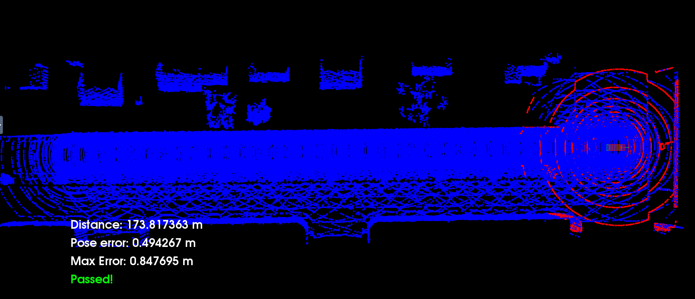

# Udacity-Localization_Project
This is my project for Udacity Self Driving Cars Nano Degree Third Module Localization Project
Using ICP
#How to use?
Copy the code at file c3-main.cpp to udacity localization project workspace to paste the code their in c3-main.cpp
Then: 
- open desktop
- open new terminal
- su - student
- cd /home/workspace/c3-project
- ./run-carla.sh
- open second terminal
- cd /home/workspace/c3-project
- cmake .
- make
- ./cloud_loc
- Use up arrow key 3 time 3 second between each (To have same results)

The final results as shown
and find above video for the results but speeded up and compressed to be uploaded here
